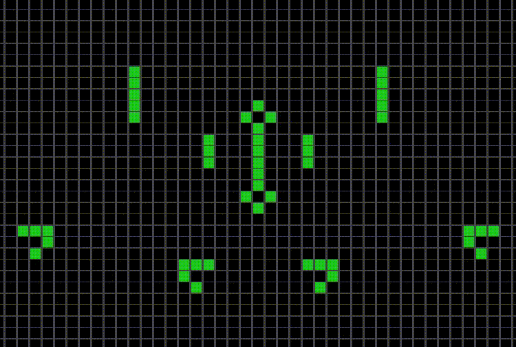

# Game-of-life

 O 'jogo da vida' foi um experimento criado em 1970 pelo matemático Jonh Conway.

 E neste projeto eu recriei esse experimento, utilizando: 

  
  
  

 
##

    
 O objetivo do experimento é simular o comportamento de celulas em grupo. Usando como base um tabuleiro bi-dimensional que segue algumas regras para funcionar. 

  

    
  

##
