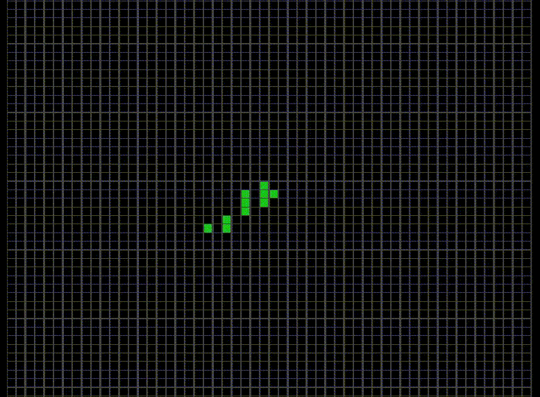
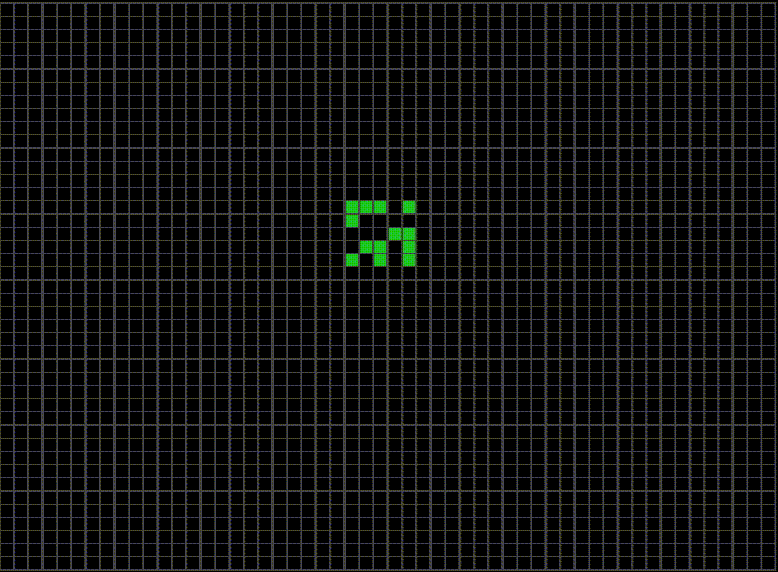
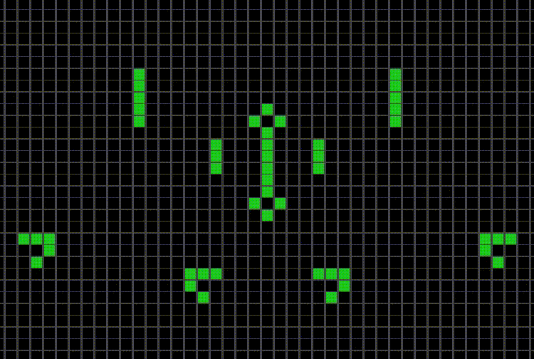
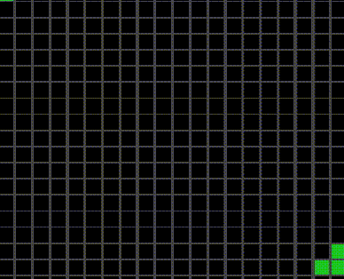

# Game of life

 

O 'jogo da vida' foi um experimento criado em 1970 pelo matemático John Conway. 
E neste projeto eu recriei esse experimento, utilizando:

 

  
  
  

 

##

  
  
  

##

 

O objetivo do experimento é simular o comportamento de celulas em grupo. Usando como base um tabuleiro bi-dimensional que segue algumas regras para funcionar:

 

* Qualquer célula viva com menos de dois vizinhos vivos morre de solidão.
* Qualquer célula viva com mais de três vizinhos vivos morre de superpopulação.
* Qualquer célula com exatamente três vizinhos vivos se torna uma célula viva.
* Qualquer célula com dois vizinhos vivos continua no mesmo estado para a próxima geração

 

Estas regras apesar de simples geram inumeras formas, uma mais impressionante que a outra.

 

##

 

Entre tantas variações surgem também alguns padrões como este:

  

